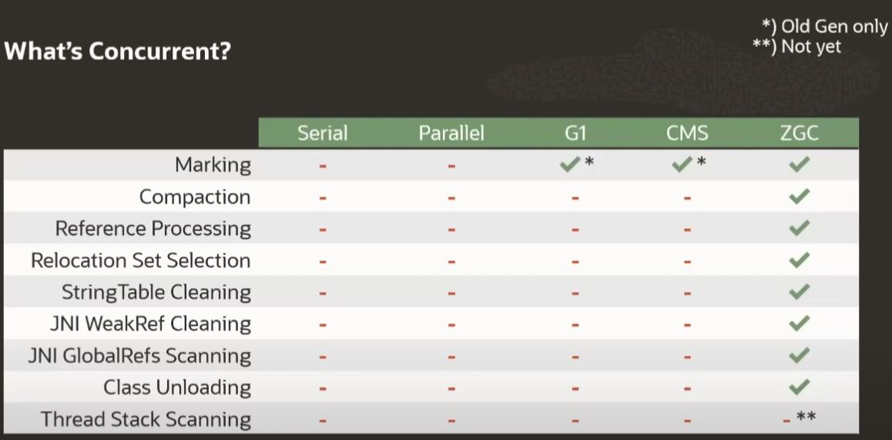

# Garbage collectors

Garbage collection je způsob spravování paměti. V Javě se explicitně nepřiřazuje paměť (napčíklad na rozdíl od C).
Při potřebě nových proměnných pokud je paměť – halda ("heap") již zaplněna, program se přeruší a spustí se algoritmus
garbage kolektoru. Hledání nepotřebných objektů, polí, proměnných.. začíná u "roots" – momentálně používané objekty programem.
Ty bere jako žívé. Poté skrze ně iteruje a hledá, zda nereferencují na jiný objekt v haldě, toto opakuje pokud neprozkoumá všechny
live objekty a jejich reference (a jejich refernece atd.). Neprojité objekty pak mohou být dealokovány.

## G1 – Garbage-First Garbage Collection

Publikace "paperu" 2004, experimentální podpora 2009 (JDK6u14), oficiální podpora 2012 (JDK7u4), výchozí GC 2017 (JDK9).
Cíl G1 je propustnost (počet transkací za vteřinu) a nízká latence (maximální počet transakcí). Výchozí pauza je 200 milisekund,
lze manuálně ladit. Vyšší "pause goal" má vyšší propustnot a vyšší latenci, nižší pauza opak.

Halda je rozdělena do několika regionů v závisloti na velikosti haldy (napčíklad pro 4 GB haldu je 2048 2MB regionů). Nové objekty
jsou inicializovány do regionů "Eden", po počtu alokovaných eden regionů se provádí "young collection" a přeživší objekty se z eden
regionů kompaktně kopírují do "Survivor" regionů. Toto probíhá stále dokola. Pokud nějaké objekty přežijí několik young collections
jsou kompaktně nakopírovány do "Old" regionů. Po postupném plnění haldy regiony eden, survivors a old začne G1 souběžně označovat
objekty v old regionech (program není přerušen). Eden, survivor a old regiony jsou poté shromažďovány v "mixed" kolekcích a "live"
objekty jsou kompaktně kopírovány do survivor a old regionů. Když už nezbývají další old regiony vhodné k tomuto shromažďování, G1 se
vrátí k vytváření young kolekcí.

G1 tedy přechází mezi těmito stavy: Young collections -> Young collection + concurrent mark -> Mixed collections -> zpět na YC

## ZGC (Z Garbage Collector) – Scalable Low-Latency Garbage Collector

Experimentální podpora JDK11, aktualizace JDK12, JDK13, JDK14, production ready JDK15.
Cíle ZGC jsou: maximální pauza GC 10 ms, až TB haldy, maximální snížení propustnosti o 15 % oproti výchozí GC – G1. Dalším cílem je 
udělat ZGC jednoduchý na ladění.

Funguje jak na malé velikosti paměti tak velké. Z algoritmického hlediska je ZGC concurrent (běží současně s vláknem programu), je
tracing (prochází objekty v hladě a zjišťuje, jaké jsou live) a compacting (přesouvá objekty po haldě), dále je single-generation,
NUMA-aware, region-based, používá load barriers a colored pointers. Pauzy GC se nezvětšují s velikostí haldy, ale zvětšují se s
velikostí rootu, který se zhruba zvětšuje s počtem vláken, které aplikace používá.

ZGC cyklus se skládá z 3 částí. Pause Mark Start (Cuncurrent mark/remap) – skenuje zásobníky vláken, z kterých dostaneme vstupní objekty
pro začátek značkování, tento graf pak prochází. Pause Mark End (Cuncurrent prepare for relocation) – konec značkování (bod
synchronizace), poté se začnou zpracovávat "soft" a "phantom" reference, odnačítat třídy (class loaders a classes) a nakonec se na 
základě značkování z 1. částí rozhodne, jaké části haldy se zhutní. Pause Relocate Start (Concurrent Relocate) – skenování zásobníků
vláken, tentokrát se hledají odkazy ukazující na množinu k přesunutí (zhutnění) a poté už následuje samotné přesouvání objektů v haldě.
Na začátku každě části tedy probíhají pauzi v maximální délce 10 milisekund.

Colored pointers – metadata od objektech jsou uložena v 64bitových pointerech s přiřazenou "barvou" dle pozice v paměti. Tato metadata
říkají o objektech, zda byly označeny, případně přesunuty. S těmito pointery úzce souvisí Load barrier – kus kódu vkládaný JITem do 
stragických míst. Účelem je při načítání reference objektu z haldy zkontrolovat, jakou má barvu (pokud má špatnou, tak referenci
"ošetřit" – označit, přesunout..., a tak vylepšit barvu a při příštím použití se tento krok může přeskočit).

## Porovnání GCs

| GC        | Optimalizován pro                |
|-----------|----------------------------------|
| Sériový   | Paměťovou stopu                  |
| Paralelní | Propustnost                      |
| G1        | Rovnováhu propustnosti a latence |
| ZGC       | Latence                          |

| GC        | GC pause times Avg.| GC pause times 99% | Throught put |
|-----------|--------------------|--------------------|--------------|
| G1        | 0,5 ms             | 1,2 ms             | 105 %        |
| ZGC       | 150 ms             | 435 ms             | 100 %        |

## Co běží souběžně s programem

